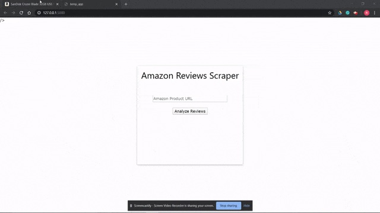
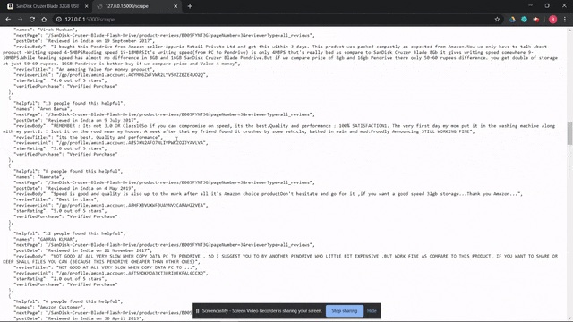

# Amazon Web Crawler
The premise of this application is simple. Scrape information from Amazon Product Sites to compile important information from the reviews. Using Scrapy and Flask, parse that data into JSON that is readable and also store it in a database using sqlite3 as the SQL database. This allows previously parsed data to be compiled into a database that is readily accessed. If the user searches the same product again, the application will grab the data straight from the user database as opposed to the web crawler, allowing faster load times.

## Technologies
This project is created with:
* Virtual Environment
* Python3
* Flask
* Scrapy
* Crochet
* sqlite3
    
 
    
## Set Up
To run this project, you should:

    $ cd into your virtual machine folder
    $ $ source [Virtual Environment]/bin/activate
    $ install dependencies using pip
    $ cd into the main folder
    $ $ python3 main.py
    
## Troubleshooting
If you ran the project and have trouble getting the JSON to parse, or are getting a 503 Service Unavailable in the terminal, this is most likely because its putting to much load on the servers. To resolve this issue, go to crawlshop/settings.py and add the following code.

    DOWNLOAD_TIMEOUT = 540
    DOWNLOAD_DELAY = 5
    DEPTH_LIMIT = 10
    EXTENSIONS = {
        'scrapy.extensions.telnet.TelnetConsole': None,
        'scrapy.extensions.closespider.CloseSpider': 1
        }
  
  This lessens the workload and ensures we don't put too much load on amazon servers. For more settings look at the Documentation below.
 
 ## Documentation
 * https://docs.scrapy.org/en/latest/intro/tutorial.html
 * https://docs.scrapy.org/en/latest/topics/settings.html
 * https://stackoverflow.com/questions/63831916/scrapy-python-web-scraping-json
 * https://stackoverflow.com/questions/22795416/how-to-handle-302-redirect-in-scrapy
 
    
## Images

